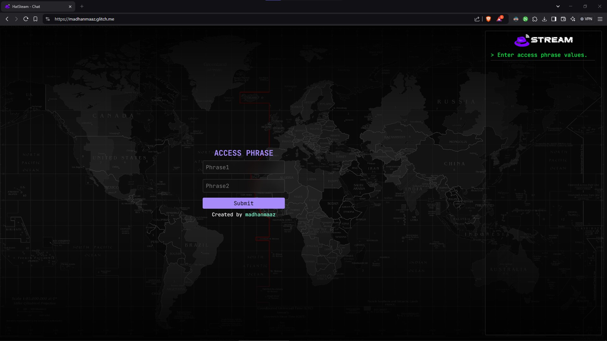
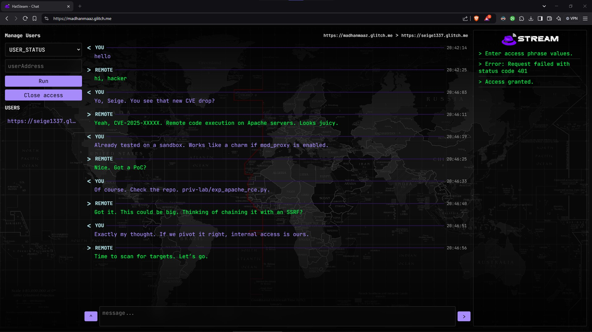

# HatStream for Hackers - Secure Decentralized Chat App

<p align=center>
  HatStream is a decentralized chat application designed for ultimate privacy and security. Utilizing AES and RSA encryption, it ensures end-to-end protection, making data transmission unreadable over HTTP and also completely unreadable by ISPs. HatStream enables direct server-to-server (S2S) data transmission. With a web-based UI, users can securely access their chats from any device without needing a VPN.
</p>

<p align=center>

</p>

#### This is my server: https://madhanmaaz.glitch.me, let's chat

### DEMO
https://github.com/user-attachments/assets/7397523d-6908-42d7-9513-3e103d3410ba




### 🚀  Features
- **Decentralized**  
- **AES & RSA encryption**  
- **Invisible to ISPs & HTTP capture**  
- **Server-to-Server (S2S) transmission**  
- **Web-based UI**  
- **No VPN required**  
- **CLI support**: [HatStream CLI GitHub](https://github.com/madhanmaaz/HatStream-cli)

### 🔧 How It Works
- **Host Your Own HatStream Server**: Each user runs a server instance.

- **Exchange Server URLs**: To chat, users share their server URLs.

- **End-to-End Encryption**: Messages are encrypted using AES before being sent.

- **Server-to-Server Communication**: Messages are sent directly between user-hosted servers.

### 📥 Installation
```bash
git clone https://github.com/madhanmaaz/HatStream
npm install
npm start
```

### 🔒 Add Phrase to ENV and Access It Later
```
PHRASE_1=<YOUR_SECRET_PHRASE_1>
PHRASE_2=<YOUR_SECRET_PHRASE_2>
```
